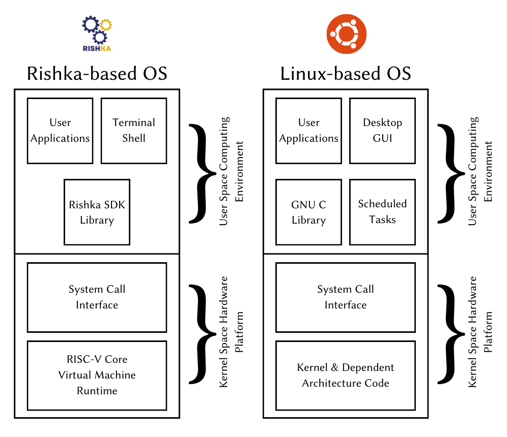
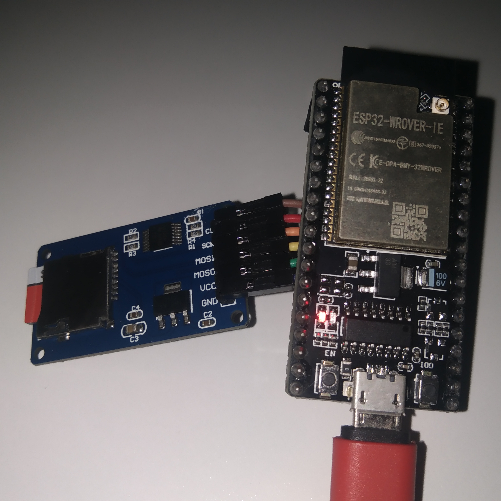
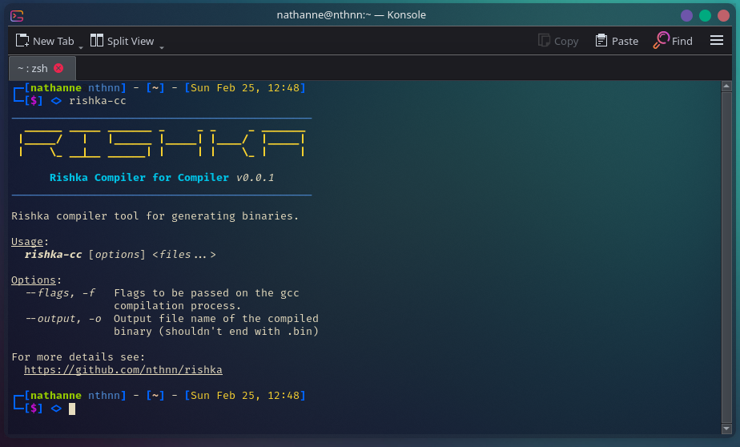

<p align="center">
    
    <h1 align="center">Rishka</h1>
</p>

    

Rishka is a RISC-V virtual runtime in C/C++ made for ESP32-WROVER with PSRAM specifically developed as kernel for [Jessy OS](https://github.com/nthnn/Jessy-OS).

> [!NOTE]
> Work in progress.

## How Does It Work?

The Rishka virtual runtime is a system designed to run special RISC-V binaries smoothly on ESP32-WROVER microcontroller units. Under the hood, the virtual machine serves as the main engine, while the kernel acts as its core component. The kernel handles system calls efficiently, providing a range of interfaces for accessing different system features and services.

<p align="center">
  
</p>

These include basic functions like managing files, as well as more complex tasks like controlling GPIO pins, attaching and detaching interrupts, and communication protocols such as I2C and SPI. Additionally, the kernel manages system utilities specific to the Jessy OS, handling tasks like sub-process runtime and memory allocation.

<p align="center">
    
</p>

<p align="center"><i>NodeMCU ESP32-WROVER and microSD card adapter where Rishka is being developed.</i></p>

## Installation

### Rishka VM

Rishka VM is a lightweight and efficient virtual runtime environment designed for RISC-V binaries on ESP32-WROVER microcontrollers. Follow these steps to integrate Rishka into your Arduino projects:

1. Clone Rishka to your Arduino libraries, by typing the command below:

```bash
cd ~/Arduino/libraries
git clone --depth 1 https://github.com/nthnn/rishka.git
```

2. Open your Arduino IDE, then navigate to `File > Examples > rishka` and select an example suitable for your project.

3. You're all set! Integrate Rishka into your project and start leveraging its capabilities.

### Compiling Examples

#### Using `rishka-cc` tool

To use `rishka-cc`, you can get it from the release page if available or compile it yourself by typing the following on your terminal. Just make sure you have installed Rust compiler and Cargo package manager on your system.

```bash
cargo build --release
```

Alternatively, you can install the `rishka-cc` tool by typing the following below on your system terminal:

```bash
sh -c "$(curl -fsSL https://raw.githubusercontent.com/nthnn/rishka/main/support/install_rishka_cc.sh)"
```

Before using `rishka-cc`, you must configure two (2) environment variables, as shown below.

```bash
export RISHKA_LIBPATH=<path to sdk library folder>
export RISHKA_SCRIPTS=<path to scripts folder>
```

The `RISHKA_LIBPATH` must be a folder where the `librishka.h` header file is located, while the `RISHKA_SCRIPTS` should be a folder where both `launch.s` and the `link.ld` files are located. For example, assuming Rishka was moved to the libraries folder on Arduino IDE:

```bash
export RISHKA_LIBPATH=/Arduino/libraries/rishka/sdk
export RISHKA_SCRIPTS=/Arduino/libraries/rishka/scripts
```

If no problems occured and was configured as instructed, you can now seamlessly use the `rishka-cc`.

<p align="center">
  
</p>

#### Manually Compiling

To compile SDK examples provided with Rishka, follow these steps:

1. If you haven't already, install Qrepo by following the instructions available [here](https://github.com/nthnn/Qrepo).

2. Ensure you have the RISC-V64 GCC toolchain installed by running:

```bash
sudo apt install gcc-riscv64-unknown-elf
```

3. Open a terminal and navigate to the directory where you cloned the Rishka repository.

4. Use Qrepo to compile the examples by executing the following command:

```bash
qrepo run compile <source-file> <output-name>
```

Replace `<source-file>` with the path to the source file of the example you want to compile and `<output-name>` with the desired name for the output binary.

Examples:

```bash
qrepo run compile examples/sdk/hello.cpp hello
# This will output the binary file to dist/hello.bin
```

Now you have successfully compiled the example and can proceed with using the generated binary file.

## Dumping Raw Binaries

Dumping raw binary files can be helpful in debugging programs, traditionally. Hence, a simple script in Qrepo is available to dump instructions from a raw binary file of Rishka. You can utilize it by typing the following:

```bash
qrepo run dump <filename>
```

## Example

This example demonstrates the usage of Rishka virtual machine on an ESP32-WROVER microcontroller. It initializes serial communication and SD card, waits for user input via serial port, loads the specified file into the Rishka VM, executes it, and then waits for the next input.

```cpp
#include <rishka.h>

rishka_virtual_machine vm;

void setup() {
    // Begin serial communication at 115200 baud rate
    Serial.begin(115200);
    // Wait until serial connection is established
    while(!Serial);

    // Initialize SD card on pin 5
    if(!SD.begin(5)) {
        // If SD card initialization fails, 
        // print error message and halt execution
        Serial.println("Failed to initialize SD card.");
        while(true);
    }

    if(!psramInit()) {
        // If PSRAM initialization fails,
        // print error message and halt execution
        Serial.println("Cannot initialize PSRAM.");
        while(true);
    }

    // Print prompt
    Serial.print("> ");
}

void loop() {
    // Check if there is data available to read from serial port
    if(!Serial.available())
        return;

    // Read input from serial port
    String input = Serial.readString();
    // Echo input back to serial port
    Serial.print(input);

    // Initialize Rishka virtual machine
    rishka_vm_initialize(&vm, &Serial);

    // Attempt to load specified file into Rishka virtual machine
    if(!rishka_vm_loadfile(&vm, input.c_str())) {
        // If loading file fails, print error message and return
        Serial.println("Failed to load specified file: " + input);
        return;
    }

    // Run loaded program on Rishka virtual machine
    rishka_vm_run(&vm, 0, NULL);
    // Reset Rishka virtual machine for next execution
    rishka_vm_reset(&vm);

    // Print prompt for next input
    Serial.print("> ");
}
```

## Contributing

Contributions to Rishka are highly encouraged and appreciated! To contribute new features, bug fixes, or enhancements, please adhere to the following guidelines:

1. Fork the Rishka repository.
2. Create a new branch for your changes: `git checkout -b feature-name`.
3. Implement your changes and commit them: `git commit -m "Added new feature"`.
4. Push your changes to the branch: `git push origin feature-name`.
5. Submit a pull request for review and inclusion.

## License

Rishka is distributed under the GNU General Public License v3.0. For further details, refer to the [LICENSE](LICENSE) file.

```
This program is free software: you can redistribute it and/or modify  
it under the terms of the GNU General Public License as published by  
the Free Software Foundation, version 3.

This program is distributed in the hope that it will be useful, but 
WITHOUT ANY WARRANTY; without even the implied warranty of 
MERCHANTABILITY or FITNESS FOR A PARTICULAR PURPOSE. See the GNU 
General Public License for more details.

You should have received a copy of the GNU General Public License 
along with this program. If not, see <http://www.gnu.org/licenses/>.
```